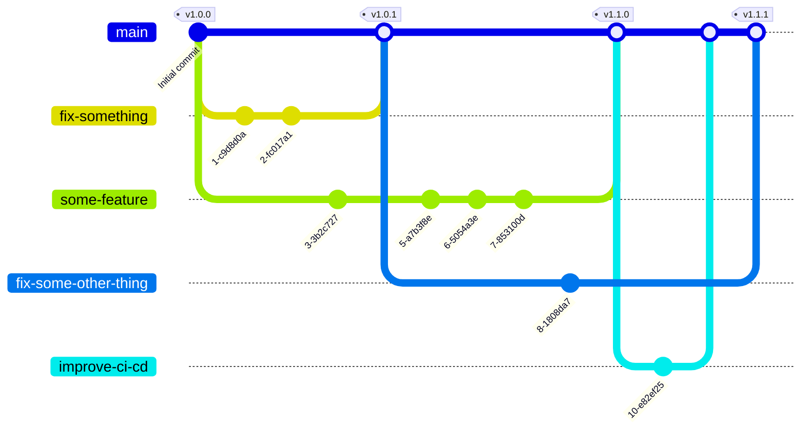
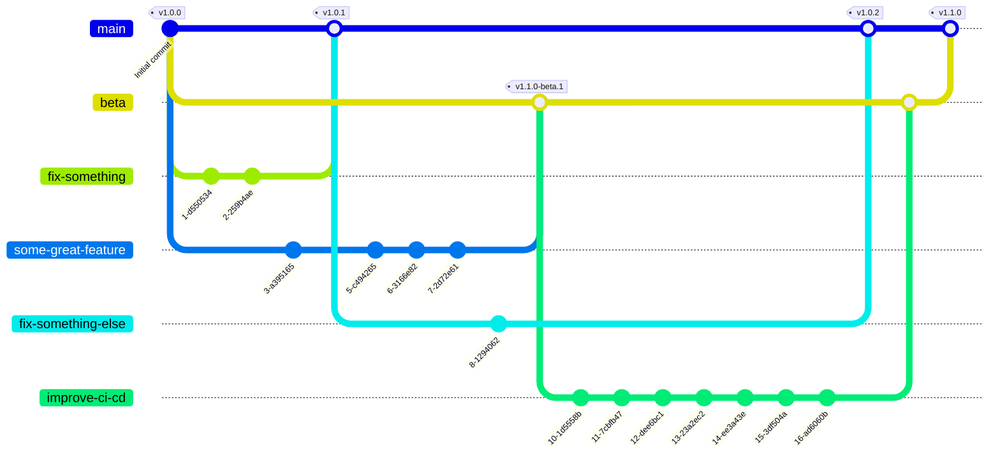
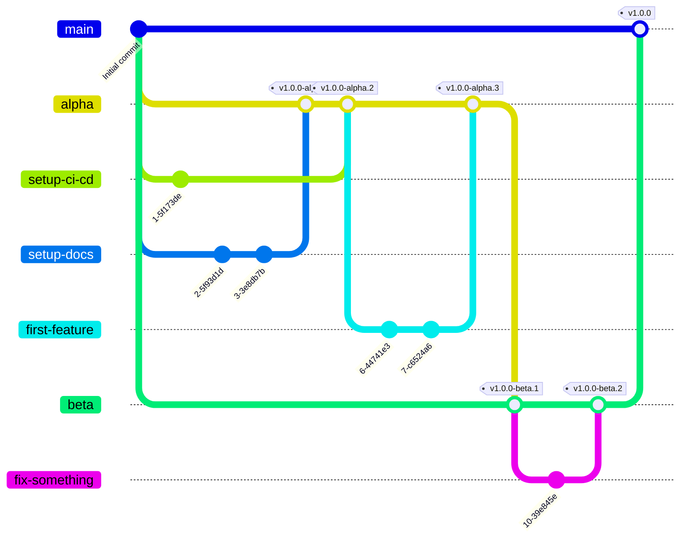

# @nexdom/uimed-vue

After clone this project, **open it inside its devContainer** using [VSCode](https://code.visualstudio.com/download).

Then, follow the next instructions according to your needs.

_Don't forget to commit your changes using [Conventional Commits](https://www.conventionalcommits.org/en/v1.0.0/) messages._

## Development

The next topics will instruct you on how to run what's already inside this project and how to add new features.

### Scripts

The following scripts will help you on your daily basis.

All code that's going to be published in the library is inside the `src` folder. Also, it's written in English, so let's try to keep it standardized.

- Install dependencies:

```bash
vp install
```

- Check environment missing parts:

> [!Tip]
> This might be useful if you got some error due to a missing command/shims or wrong dependency version.

```bash
vp env doctor
```

- Create shims you might need, like `vpr` and `vpx`:

```bash
vp env setup
```

- Run checks (Lint, formmater and type-check):

```bash
vpr check
# Or
vp run check
```

_This script might require `build` first._

- Run the unit tests:

```bash
vpr test
# Or
vp run test
```

- Run mutation tests:

```bash
vpr test:mutations
# Or
vp run test:mutations
```

- Run the E2E tests:

```bash
vpr test:e2e
# Or
vp run test:e2e
```

- Run architecture checks:

```bash
vpr depcruise
# Or
vp run depcruise
```

- Help with Vite+ resources:

```bash
vp --help
```

### Architecture

#### Components

Since `@nexdom/uimed-vue` is a frameworks, we shall not expose any trace of its internal implementations.

To do so, **the following code is recommended for every component**, since it restricts a component use to the exposed API only:

```vue
<script lang="ts">
/**
 * A short description of the component, shown when hovering it in the
 * editor.
 */
export default {
  inheritAttrs: false,
};
</script>

<script setup lang="ts">
// component's implementation
</script>
```

## Documentation

The success of this projects also depends on the quality of its documentation.

To help you dealing with that, we prepared a `docs` folder, which will be used to generate documentation pages based on markdown files (thanks to `Vitepress`).

> [!Tip]
> Unlike the `src`, `docs` it written in English, but aimed for Brazilian users, mostly, so it's content should be written in Portuguese.

But, that's not everything. Since the best documentation is the one you don't have to open, we ask you to use [JSDoc](https://jsdoc.app/about-getting-started) on the methods you intend to expose from the API. That can be easily accomplished by just typing `/**` and `enter` at the row before your `method` or `attribute`.

JSDoc handles markdown pretty well, so you can easily provide rich format documentations, like code examples, right inside your comments.

Tho check how your markdown pages are going, just...

- Run docs page:

```bash
vpr docs
# Or
vp run docs
```

> [!Tip]
> The docs theme imports the library from `dist`, not from `src`, so `vpr docs` alone only builds it once. If you're actively editing components and want the docs to keep reflecting your changes, run `vpr dev` (or `vp pack --watch`) on a second terminal alongside `vpr docs:dev`. Still stale? Try clearing `docs/.vitepress/cache`.

## Opening a Pull Request

Following [Semantic Release recommendations](https://semantic-release.org/foundation/supported-branching/#trunk-based-development), this project uses [Trunk-Based Development](https://beyond.minimumcd.org/docs/reference/practices/trunk-based-development/). That said, you might want to read the next instructions before creating your branch and submit it as a Pull Request.

Keep in mind that we only have one long-living branch, which is `main` (our _`trunk`_ branch).

Every short-lived branch must aim to reach `main` sometime. Always through pull requests, of course, since branch `main`, also `beta` and `alpha` eventually, are protected against direct push.

### When to use `main` (_`trunk`_)?

The majority of new features, bug fixes and minor updates (like documentations or CI/CD changes) will come from a short-lived branch (named based on its intention, e.g. "`fix-some-method-behavior`").

Short-lived branches, as mentioned before, originate from branch `main`, and will, as soon as possible, go back to `main` through a Pull Request. As soon as the PR is merged, the origin branch must be deleted.

The diagram bellow illustrates that workflow:



_Exceptions to this flow will be described on [When to use `beta`?](#when-to-use-beta) and [When to use `alpha`?](#when-to-use-alpha)._

### When to use `beta`?

If you're implementing something that's not production ready for sure (a `pre-release`), or method signatures (API) might still change, prefer using `beta`.

Here, what you'll do is create a branch `beta`, from `main`, if it's not already created. Then open your branch from `beta` and send it back (to `beta`) as a PR when it's ready to be tested.

As soon as all changes inside beta are actually production ready, which must not linger, merge `beta` into `main` using a PR.

_Just like any other branch, as soon as the PR from `beta` to `main` is merged, the branch `beta` must be deleted (at least until new a `beta` is needed)._

_Sometimes merging `beta` straight into `main` won't be possible duo some merge conflicts and the protection rule that prevents pushes (including rebases or merge resolving commits) into `main`, `beta` and `alpha`. To solve it, create an intermediary branch, from `beta`, rebase it with `main` and use it to create your PR. Remember to delete both branches, `beta` and the temporary branch, after merge._

The `beta` branch flow should looks something like this:



### When to use `alpha`?

Sometimes, when you don't even have enough resources to test something, like when you've just created a new project/library from a template, or started to prototype a new feature, you need `alpha`.

Create `alpha` from `main` and work on it just like you would on `beta`. The moment your changes become stable enough for starting test phase, promote tem to `beta` by creating a new branch `beta` from `main`, if it's not already there, and push `alpha` into `beta`using a Pull Request.

For that moment on, everything should comply according to [When to use `beta`?](#when-to-use-beta) specifications.

The whole flow will look like this:



## Publishing

This lib and its documentations will be published by pipelines, with no need of human interference.

So that you know, behind the scenes, the following scripts will run to do that:

- Build the library:

```bash
vpr build
# Or
vp run build
```

- Build docs:

```bash
vpr docs:build
# Or
vp run docs:build
```
